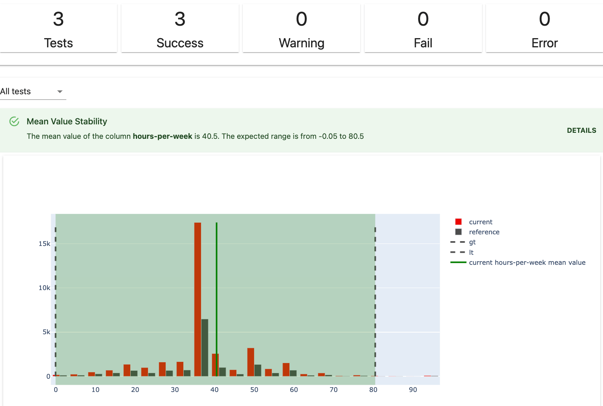
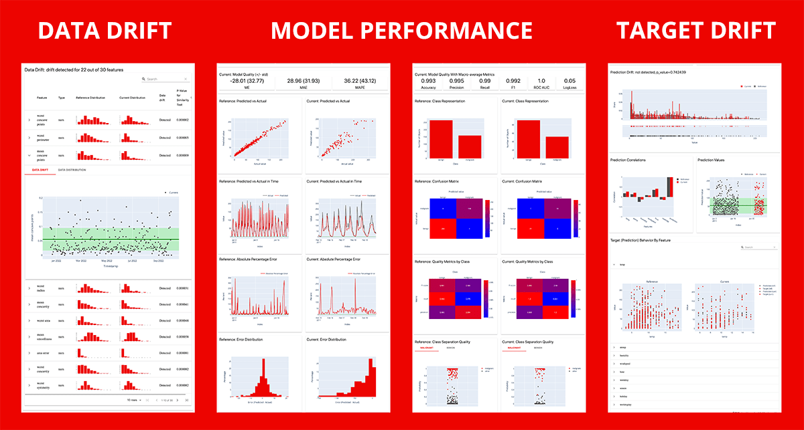

Evidently is an open-source Python library for data scientists and ML engineers. 

It helps evaluate, test, and monitor the performance of ML models from validation to production.

## Quick Start 

Understand the basic functionality in under 10 minutes:

[Get started tutorial](get-started/tutorial.md). 


See the code examples:

[Example](get-started/examples.md). 


# How it works 

Evidently helps evaluate and test data and ML model quality throughout the model lifecycle.

Evidently has three main components: **Reports**, **Tests**, and **Monitors** (in development). These interfaces cover alternative usage scenarios: from ad hoc visual model debugging to automated pipeline testing and real-time monitoring.

To use the tool, you need to provide the data, choose what to evaluate, and the output format. Evidently has a simple, declarative API and a library of metrics, tests, and visualizations to choose from.

You can integrate Evidently into various ML stacks as a monitoring or evaluation component.

Evidently currently works with tabular data. 

# 1. [Tests](tests/README.md): batch model checks 

Tests perform structured data and ML model quality checks. You typically compare two datasets: **reference** and **current**. 
 
You can set test parameters manually or let Evidently learn the expectations from the reference dataset. Tests verify a condition and return an explicit **pass** or **fail** result. 
 
You can create a **Test Suite** from 50+ individual tests or run one of the **presets** that combine relevant tests. For example, DataStability or Regression performance presets.
 
Tests are best for automated batch model checks.

**Required input**: one or two datasets as pandas.DataFrames or csv.
 
**How you get the output**: as an HTML inside Jupyter notebook or Colab, as an exportable HTML file, as a JSON, or as a Python dictionary.
 
**Primary use case: test-based ML monitoring**. You can integrate and run tests automatically as a step in the ML pipeline. For example, when you receive a new batch of data, new labels, or generate predictions. You can build a conditional workflow based on the test results, e.g., to trigger an alert, retrain, or get a visual report for debugging.  

Read more:
* [Overview: how the tests look](tests/overview.md) 
* [User guide: how to generate tests](tests-and-reports/run-tests.md) 
* [All presets](tests/README.md)
* [All tests](reference/all-tests.md) 

# 2. [Reports](reports/README.md): interactive dashboards


We added a new Report object starting from **v0.1.57.dev0**. Reports unite the functionality of Dashboards and JSON profiles with a new, cleaner API. 


Reports calculate various metrics and provide rich interactive visualizations. 
 
You can create a custom **Report** from individual metrics or run one of the **Presets** that cover a specific aspect of the model or data performance. For example, a Data Quality report or Classification Performance report.
 
Reports are best for exploratory analysis, debugging, and documentation.

**Required input**: one or two datasets as pandas.DataFrames or csv. Due to rich embedded visualizations, it is recommended to take a smaller sample. Otherwise, reports might not render.
 
**How you get the output**: as an HTML inside Jupyter notebook or Colab, as an exportable HTML file, as JSON, or as a Python dictionary.
 
**Primary use case**: debugging and exploration. Reports help visually evaluate the data or model performance. For example, during exploratory data analysis, model evaluation on the training set, when debugging the model quality decay, or comparing several models.  
 
**Secondary use cases**: 
* **Performance logging**. You can integrate a model/data evaluation step in the ML pipeline, get outputs as JSON, and log it for further analysis. For example, you can later visualize it using other BI tools.
* **Reporting and documentation**. You can generate visual HTML reports to document your model performance.   

**Read more**:
* [Available reports](reports/README.md) 
* [User guide: how to run reports](tests-and-reports/get-reports.md) 

# 3. [Real-time ML monitoring](integrations/evidently-and-grafana.md)

*Note: this functionality is in early development and subject to an API change*. 

Evidently also has `Monitors` that collect data and model metrics from a deployed ML service. 

In this scenario, Evidently is deployed as a monitoring service. You can use configuration to define the monitoring logic. Evidently calculates the metrics over the streaming data and emits them in Prometheus format. There are pre-built Grafana dashboards to visualize them.

**Required input**: POST live data from the ML service. 

**How you get the output**: data and quality metrics in the Prometheus format.
 
**Primary use case: online monitoring**. When you need a live dashboard that is updated close to real-time. 
 
Read more:
* [Example integration with Prometheus and Grafana](integrations/evidently-and-grafana.md)

# Community and support 

Evidently is in active development, and we are happy to receive and incorporate feedback. If you have any questions, ideas or want to hang out and chat about doing ML in production, [join our Discord community](https://discord.com/invite/xZjKRaNp8b)!

