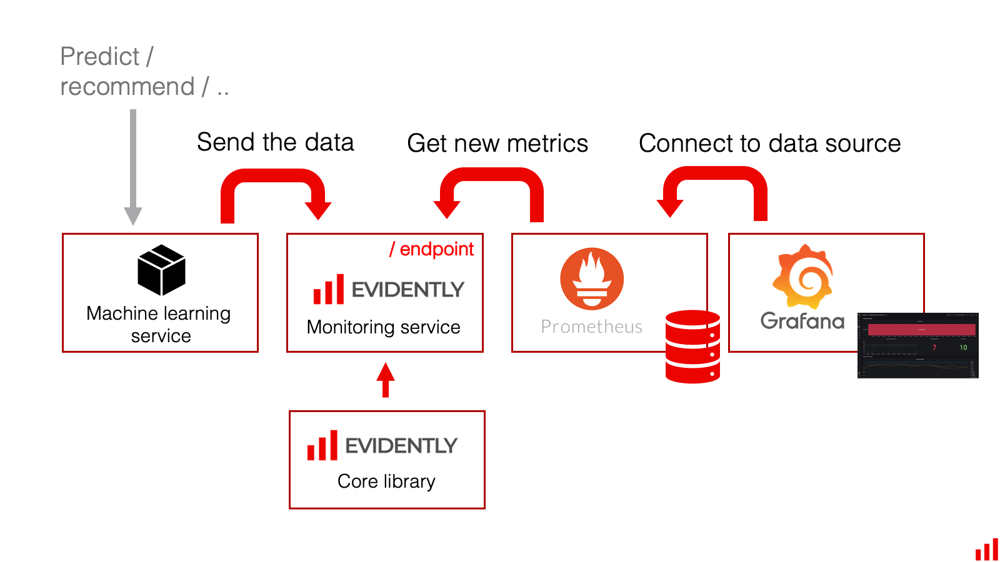

# Evidently and Grafana for real-time ML monitoring 

Evidently has a monitoring_service component that can collect data and model metrics from an ML service. It is based on the shared analyzer functionality and can return the same output metrics and statistical tests as Dashboards and JSON profiles. 

The core difference from JSON profiles is the ability to calculate metrics on top of the streaming data. It includes the configuration options that help define the monitoring logic by setting options like the size of the window, choice of moving reference, etc.    

The monitoring service outputs the metrics that can be further logged elsewhere. It is currently recommended to use the Evidently monitoring service together with Grafana and Prometheus. 

Grafana is an open-source [data visualization platform](https://github.com/grafana/grafana). It is frequently paired with the Prometheus [time series database](https://github.com/prometheus/prometheus) to monitor software system performance.

You can use this same stack for ML monitoring. In this case, Evidently provides a metrics calculation layer, Prometheus is used to store the metrics, and Grafana is used to display the dashboards and manage alerts. 

**An integration example is available as a Docker container:**


Follow the readme to install and modify the example to adapt it to your use case.

It contains pre-built dashboards to display Evidently reports in the Grafana interface.

## 1. Data Drift Dashboard

We plan to add more pre-built dashboards in the future.
