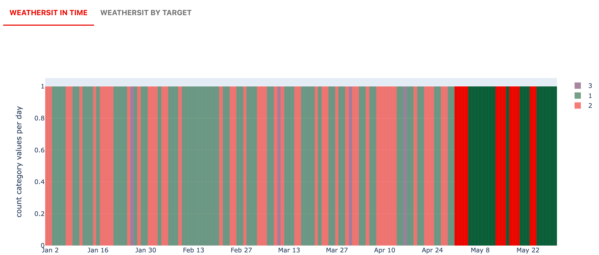
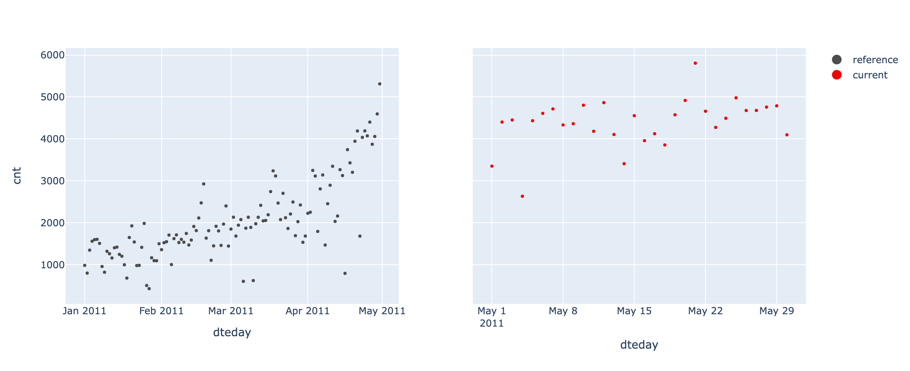
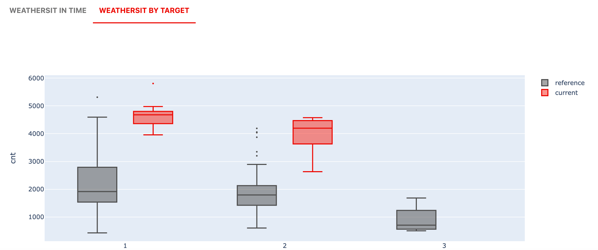
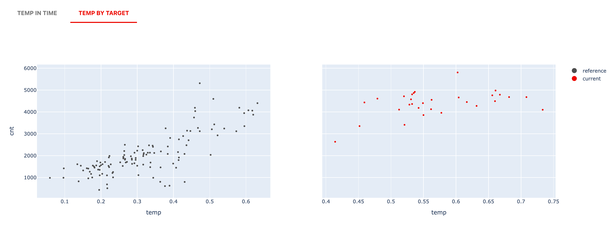

# Data Quality

**TL;DR:** The report provides a detailed feature overview.

* Calculates base statistics for numerical, categorical and datetime features
* Displays interactive plots with data distribution and behavior in time
* Plots interactions for features and target
* Works for a single dataset or compares the two 

## Summary

The Data Quality report provides detailed feature statistics and a feature behavior overview. 

It can also compare any two datasets, e.g., train and test, reference and current data, or two subgroups of one dataset (e.g., customers in different regions).

## Requirements

If you want to run this report for a single dataset, you need to prepare a `pandas.DataFrame` or `csv` file with features you want to explore. Pass it as **reference** data.
* If you have a **datetime** column and want to learn how features change with time, specify the datetime column in the `column_mapping` parameter.
* If you have a **target** column and want to see features distribution by target, specify the target column in the `column_mapping` parameter. 

To compare two datasets, you need two `DataFrames` or `cs`v files. The schema of both datasets should be identical.

Feature types (numerical, categorical, datetime) will be parsed based on pandas column type. If you work with `csv` files in CLI, or want to specify a different feature mapping strategy, you can explicitly set this using `column_mapping`.


You can read more to understand [column mapping](../dashboards/column_mapping.md) and [data requirements](../dashboards/data_requirements.md) in the corresponding sections.  


## How it looks

The default report includes 3 components. All plots are interactive.

### 1. Feature overview table

The table shows relevant statistical summaries for each feature based on its type and a visualization of feature distribution. 

#### Example for a categorical feature:


#### Example for a numerical feature:


#### Example for a datetime feature:


### 2. Feature in time

If you click on "details", each feature would include additional visualization to show feature behavior in time.

#### Example for a categorical feature:



#### Example for a numerical feature:


#### Example for a datetime feature:



### 3. Feature by target 

Categorical and numerical features include an additional visualization that plots the interaction between a given feature and the target. 

#### Example for a categorical feature:



#### Example for a numerical feature:



## JSON Profile

If you choose to generate a JSON profile, it will contain the following information:

```yaml
{
  'data_quality': {
    'data': {
      'cat_feature_names': [],
      'datetime_feature_names': [],
      'metrics': {
        'current': {
          'feature_name': {
            'count': count,
            'feature_type': 'num',
            'infinite_count': 0,
            'infinite_percentage': 0.0,
            'max': max,
            'mean': mean,
            'min': min,
            'missing_count': 0,
            'missing_percentage': 0.0,
            'most_common_value': most_common_value,
            'most_common_value_percentage': most_common_value_percentage,
            'percentile_25': percentile_25,
            'percentile_50': percentile_50,
            'percentile_75': percentile_75,
            'std': std,
            'unique_count': unique_count,
            'unique_percentage': unique_percentage
            },
          },
        'reference': {
          'feature_name': {
            'count': count,
            'feature_type': 'num',
            'infinite_count': 0,
            'infinite_percentage': 0.0,
            'max': max,
            'mean': mean,
            'min': min,
            'missing_count': 0,
            'missing_percentage': 0.0,
            'most_common_value': most_common_value,
            'most_common_value_percentage': most_common_value_percentage,
            'percentile_25': percentile_25,
            'percentile_50': percentile_50,
            'percentile_75': percentile_75,
            'std': std,
            'unique_count': unique_count,
            'unique_percentage': unique_percentage
            }
          }
        },
        'num_feature_names': [],
        'target_names': None,
        'utility_columns': {
          'date': 'dteday',
          'id': None,
          'prediction': 'prediction',
          'target': 'target'
          }
        },
    'datetime': '2022-02-22 16:35:15.529404',
    'name': 'data_quality'
    },
  'timestamp': 'timestamp'
}
```
## When to use this report

Here are a few ideas on how to use the report:

1. **Exploratory data analysis.** You can use the visual report to explore your initial training dataset and understand which features are stable and useful enough to use in modeling. 
2. **Dataset comparison.** You can use the report to compare two datasets to confirm similarity or understand the differences. For example, you might compare training and test dataset, subgroups in the same dataset (e.g. customers from Europe and from Asia), or current production data against training.
3. **Data profiling in production.** You can use the report to log and store JSON snapshots of your production data stats for future analysis. You can combine this with testing data distributions for drift using [Data Drift](data-drift.md) report.    
4. **Production model debugging.** If your model is underperforming, you might use this report to explore and interpret the details of changes in the input data.

## Data Quality Report Examples

* Browse our [example](../get-started/examples.md) notebooks to see sample Reports.
