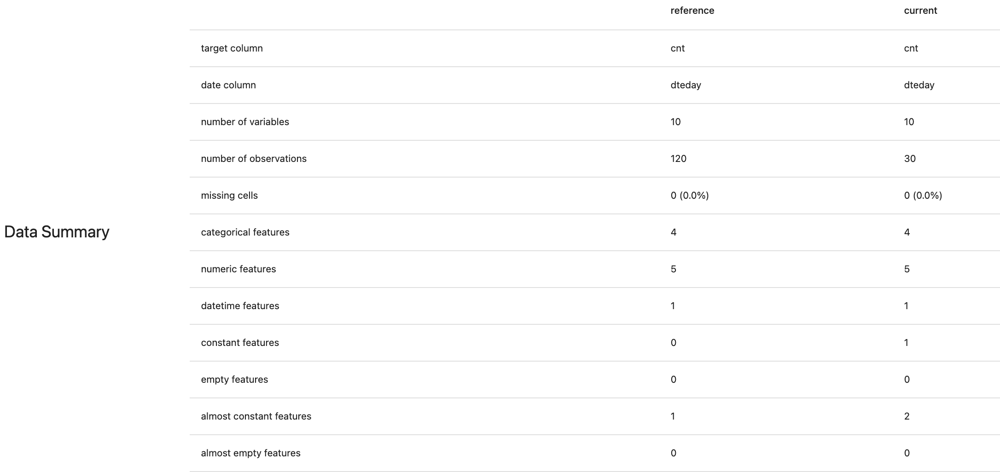
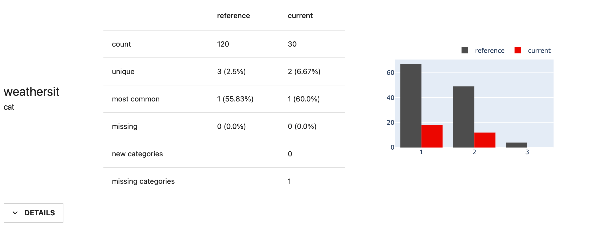
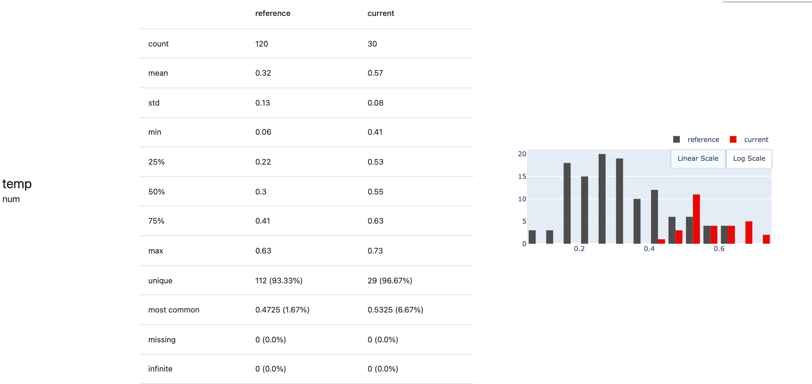
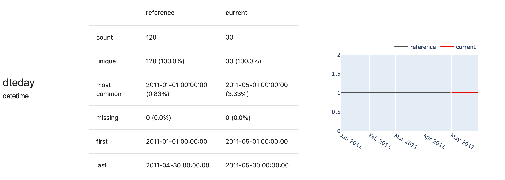
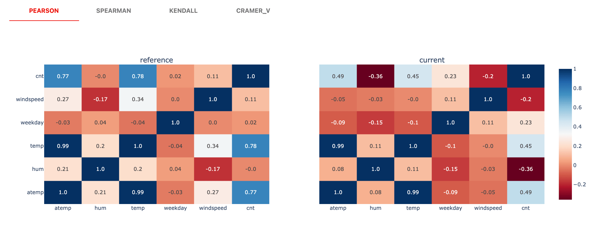

# Data Quality

**TL;DR:** The report provides a detailed dataset overview.

* Calculates base statistics for numerical, categorical and datetime features 
* Displays interactive plots with data distribution and behavior in time
* Plots interactions and correlations between features and target

The report works for a single dataset or compares the two. 

## Summary

The Data Quality report provides detailed feature statistics and feature behavior overview. 

It can also compare any two datasets. You can use it to compare train and test data, reference and current data, or two subgroups of one dataset (e.g., customers in different regions).

## Requirements 

If you want to run this report for a single dataset, you need to prepare a `pandas.DataFrame` or `csv` file with features you want to explore. Pass it as **reference** data.
* If you have a **datetime** column and want to learn how features change with time, specify the datetime column in the `column_mapping` parameter.
* If you have a **target** column and want to see features distribution by target - specify the target column in the `column_mapping` parameter. 

To compare two datastes, you need two `DataFrames` or `csv` files. The schema of both datasets should be identical.

Feature types (numerical, categorical, datetime) will be parsed based on pandas column type. If you work with `csv` files in CLI, or want to specify a different feature mapping strategy, you can explicitly set the feature type using `column_mapping`.

The report contains the section that plots interactions between the features and the target. It will look slightly different for classification and regression tasks. By default, if the target has a numeric type and has >5 unique values, Evidently will treat it as a regression problem. Everything else is treated as a classification problem. If you want to explicitly define your task as `regression` or `classification`, you should set the `task` parameter in the `column_mapping` object. 


You can read more to understand [column mapping](../dashboards/column_mapping.md) and [data requirements](../dashboards/data_requirements.md) for Evidently reports in the corresponding sections of documentation.  


## How it looks

The default report includes 3 widgets. All plots are interactive.

### 1. Summary widget

The table gives an overview of the dataset, including missing or empty features and other general information. It also shows the share of almost empty and almost constant features. This applies to cases when 95% or more features are missing or constant.



### 2. Features widget

For each feature, this widget generates a set of visualizations. They vary depending on the feature type. There are 3 components:

#### 2.1. Feature overview table

The table shows relevant statistical summaries for each feature based on its type and a visualization of feature distribution. 

##### Example for a categorical feature:



##### Example for a numerical feature:



##### Example for a datetime feature:



#### 2.2. Feature in time

If you click on "details" for each feature, you will see additional visualizations to show the feature behavior in time.

##### Example for a categorical feature:


##### Example for a numerical feature:


##### Example for a datetime feature:


#### 2.3. Feature by target 

Categorical and numerical features include an additional visualization that plots the interaction between a given feature and the target. 

##### Example for a categorical feature:


##### Example for a numerical feature:


### 3. Correlation widget

This widget shows the correlations between different features. 

#### 3.1. Insights

This table shows a summary of pairwise feature correlations.  

For a single dataset, it lists the top-5 highly correlated variables from Cramer's v correlation matrix (categorical features) and from Spearman correlation matrix (numerical features).

For two datasets, it lists the top-5 pairs of variables **where correlation changes** the most between the reference and current datasets. Similarly, it uses categorical features from Cramer's v correlation matrix and numerical features from Spearman correlation matrix.


#### 3.2. Correlation heatmaps

This section includes four heatmaps. 

For categorical features, Evidently calculates the [Cramer's v](https://en.wikipedia.org/wiki/Cramér%27s_V) correlation matrix.
For numerical features, Evidently calculates the [Pearson](https://en.wikipedia.org/wiki/Pearson_correlation_coefficient), [Spearman](https://en.wikipedia.org/wiki/Spearman%27s_rank_correlation_coefficient) and [Kendall](https://en.wikipedia.org/wiki/Kendall_rank_correlation_coefficient) matrices. 

If your dataset includes the target, the target will be also shown in the matrix according to its type. 



## JSON Profile

If you choose to generate a JSON profile, it will contain the following information:

```yaml
{
  'data_quality': {
    'data': {
      'cat_feature_names': [],
      'datetime_feature_names': [],
      'metrics': {
        'current': {
          'feature_name': {
            'count': count,
            'feature_type': 'num',
            'infinite_count': 0,
            'infinite_percentage': 0.0,
            'max': max,
            'mean': mean,
            'min': min,
            'missing_count': 0,
            'missing_percentage': 0.0,
            'most_common_value': most_common_value,
            'most_common_value_percentage': most_common_value_percentage,
            'percentile_25': percentile_25,
            'percentile_50': percentile_50,
            'percentile_75': percentile_75,
            'std': std,
            'unique_count': unique_count,
            'unique_percentage': unique_percentage
            },
          },
        'reference': {
          'feature_name': {
            'count': count,
            'feature_type': 'num',
            'infinite_count': 0,
            'infinite_percentage': 0.0,
            'max': max,
            'mean': mean,
            'min': min,
            'missing_count': 0,
            'missing_percentage': 0.0,
            'most_common_value': most_common_value,
            'most_common_value_percentage': most_common_value_percentage,
            'percentile_25': percentile_25,
            'percentile_50': percentile_50,
            'percentile_75': percentile_75,
            'std': std,
            'unique_count': unique_count,
            'unique_percentage': unique_percentage
            }
          }
        },
        'num_feature_names': [],
        'target_names': None,
        'utility_columns': {
          'date': 'dteday',
          'id': None,
          'prediction': 'prediction',
          'target': 'target'
          }
        },
      'correlations': {
        'reference': {
          'pearson': {
            'feature_name_1': {
              'feature_name_2': value,
              'feature_name_3': value
              },
            'feature_name_2': {
              'feature_name_1': value,
              'feature_name_3': value
              },
            'feature_name_3': {
              'feature_name_1': value,
              'feature_name_2': value
              }
            },
          'spearman': {
            'feature_name_1': {
              'feature_name_2': value,
              'feature_name_3': value
              },
            'feature_name_2': {
              'feature_name_1': value,
              'feature_name_3': value
              },
            'feature_name_3': {
              'feature_name_1': value,
              'feature_name_2': value
              }
            },
          'kendall': {
            'feature_name_1': {
              'feature_name_2': value,
              'feature_name_3': value
              },
            'feature_name_2': {
              'feature_name_1': value,
              'feature_name_3': value
              },
            'feature_name_3': {
              'feature_name_1': value,
              'feature_name_2': value
              }
            },
          'cramer_v': {
            'feature_name_4': {
              'feature_name_5': value
              },
            'feature_name_5': {
              'feature_name_4': value
              }
            }  
          }
        }  
    'datetime': '2022-02-22 16:35:15.529404',
    'name': 'data_quality'
    },
  'timestamp': 'timestamp'
}
```
## When to use this report

Here are a few ideas on how to use the report:

1. **Exploratory data analysis.** You can use the visual report to explore your initial training dataset and understand which features are stable and useful enough to use in modeling. 
2. **Dataset comparison.** You can use the report to compare two datasets to confirm similarity or understand the differences. For example, you might compare training and test dataset, subgroups in the same dataset (e.g. customers from Europe and from Asia), or current production data against training.
3. **Data profiling in production.** You can use the report to log and store JSON snapshots of your production data stats for future analysis. You can combine this with testing data distributions for drift using [Data Drift](data-drift.md) report.    
4. **Production model debugging.** If your model is underperforming, you might use this report to explore and interpret the details of changes in the input data.

## Data Quality Report Examples

* Browse our [example](../get-started/examples.md) notebooks to see sample Reports.
