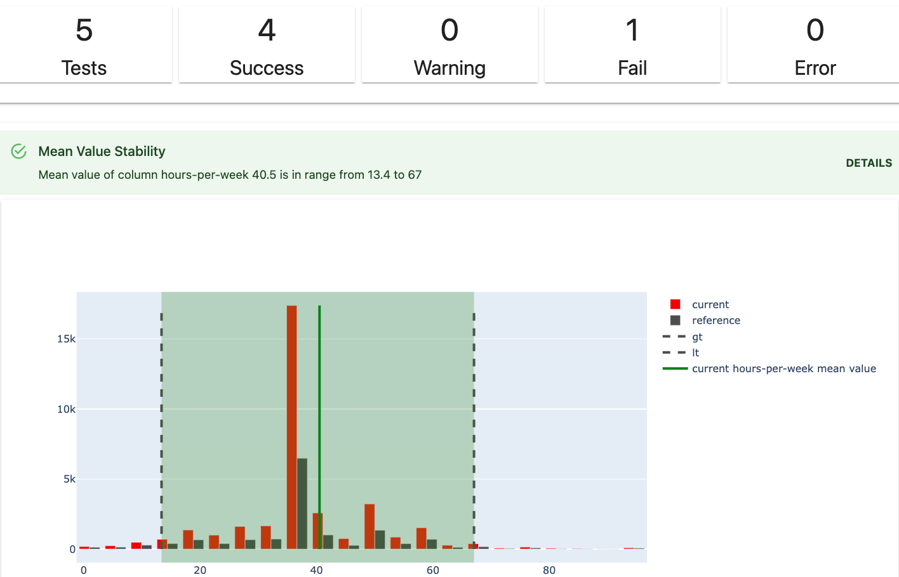

# What is a test?

Tests help perform structured data and ML model performance checks. 

Tests are best-suited for integration in ML prediction pipeline, for example, with tools like Airflow. You can also execute the tests in the Jupyter notebook and Colab. The output is available as a JSON or as an HTML report.

A **test** is a single check. It calculates a specific metric and compares it with the defined condition or threshold. Some tests require a reference dataset for comparison. When possible, tests also have default conditions. If the user does not specify a condition, Evidently will compare the metric value against this default.   

The test can return one of the following results: 
* **Success**: test condition is satisfied.
* **Fail**: test condition is not satisfied; the test has top priority.
* **Warning**: test condition is not satisfied; the test has secondary priority. (The test importance parameter will be available in the next release.)  
* **Error**: the test execution failed.

A **test suite** is a combination of checks grouped for a particular use case. A test suite executes multiple tests simultaneously and returns the summary of results. You can create your test suite from individual tests or use one of the existing **presets**. 
